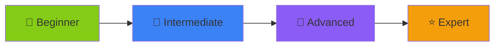
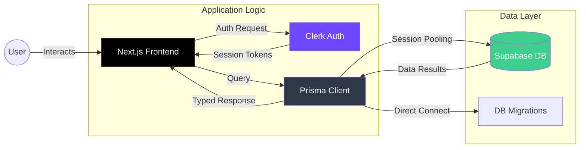

<div align="center">

# 📚 The Dev Pocket


<p align="center">
 <p class="tagline">
  Curated resources, interactive tools, and step-by-step roadmaps 
  for <span>learners</span>, <span>students</span>, and <span>developers</span>.
</p>


</p>

<br/>


<br/>

```ascii
┌─────────────────────────────────────────────────────────┐
│  🎯 Learn → 🛠️ Build → 🚀 Deploy → 🤝 Contribute       │
└─────────────────────────────────────────────────────────┘
```

</div>

## 📑 Table of Contents

- [🌟 Features](#-features-that-set-us-apart)
- [🛠️ Tech Stack](#-tech-stack)
- [System Architecture](#-system-architecture)
- [🚀 Getting Started](#-getting-started-developer-mode)
- [🤝 Contributing](#-contributing)
- [🎯 Open Source Programs](#-open-source-programs)
- [👥 Contributors](#-our-amazing-contributors)
- [👨‍💻 Project Maintainer](#-project-maintainer)
- [📄 License](#-license)
- [⭐ Show Your Support](#-show-your-support)

---

## 🌟 Features That Set Us Apart

<table>
<tr>
<td width="50%">

### 📖 Rich Learning Resources
Carefully curated content for **Web Development**, **DSA**, **AI/ML**, and cutting-edge technologies

</td>
<td width="50%">

### 🛠️ Interactive Tools
Boost productivity with hands-on coding practice tools and utilities

</td>
</tr>
<tr>
<td width="50%">

### 🎯 Guided Roadmaps
Crystal-clear paths for developers at every stage of their journey

</td>
<td width="50%">

### 🌍 Community-Powered
Built by developers, for developers with open source spirit

</td>
</tr>
</table>

<div align="center">


```mermaid
graph LR
    A[🌱 Beginner] --> B[💪 Intermediate]
    B --> C[🚀 Advanced]
    C --> D[⭐ Expert]
    style A fill:#84cc16
    style B fill:#3b82f6
    style C fill:#8b5cf6
    style D fill:#f59e0b
```

</div>

---

## 🛠️ Tech Stack

<div align="center">

| Category | Technologies |
|----------|-------------|
| **Frontend** |     |
| **Backend** |   |
| **Database** |   |
| **Auth** |  |
| **Deployment** |  |

</div>

---

## 🏗️ System Architecture

To help contributors understand how **The Dev Pocket** handles data and authentication, here is a visual representation of our tech stack integration:

<div align="center">


```mermaid
graph LR
    User((User)) -- Interacts --> NextJS[Next.js Frontend]
    
    subgraph "Application Logic"
        NextJS -- Auth Request --> Clerk[Clerk Auth]
        NextJS -- Query --> Prisma[Prisma Client]
    end

    subgraph "Data Layer"
        Prisma -- Session Pooling --> Supabase[(Supabase DB)]
        Prisma -- Direct Connect --> Migrations[DB Migrations]
    end

    Clerk -- Session Tokens --> NextJS
    Supabase -- Data Results --> Prisma
    Prisma -- Typed Response --> NextJS

    style NextJS fill:#000,color:#fff,stroke:#333
    style Clerk fill:#6C47FF,color:#fff
    style Supabase fill:#3ECF8E,color:#fff
    style Prisma fill:#2D3748,color:#fff
```

---

## 🚀 Getting Started (Developer Mode)

<details open>
<summary><b>📦 Quick Setup Guide</b></summary>

<br/>

### 1️⃣ Fork & Clone Repository

```bash
# Clone the repository
git clone https://github.com/Darshan3690/The-Dev-Pocket.git

# Navigate to project directory
cd The-Dev-Pocket
```

### 2️⃣ Install Dependencies

```bash
npm install
# or
yarn install
# or
pnpm install
```

### 3️⃣ Set Up Supabase Database (Prisma)

> ⚠️ Important: Prisma CLI does **not** load `.env.local`.  
> Please use a `.env` file for database configuration.

1. 🌐 Visit [Supabase](https://supabase.com)
2. ➕ Create a new project
3. ⚙️ Go to **Settings → Database → Connection string**

You will need **two connection URLs** from Supabase:
- **Session pooler URL** (used by Prisma Client)
- **Direct connection URL** (used by Prisma migrations)

4. 📝 Create a `.env` file in the project root (same level as `package.json`) and add:

```env
DATABASE_URL="postgresql://postgres:<PASSWORD>@db.xxxxx.supabase.co:6543/postgres?pgbouncer=true"
DIRECT_URL="postgresql://postgres:<PASSWORD>@db.xxxxx.supabase.co:5432/postgres"
RATE_LIMIT_MODE="INMEM"
```

If you want to use the Redis-backed rate limiter instead of the local in-memory fallback, also add:

```env
RATE_LIMIT_MODE="UPSTASH"
UPSTASH_REDIS_REST_URL="https://<your-upstash-endpoint>"
UPSTASH_REDIS_REST_TOKEN="<your-upstash-token>"
```

### 4️⃣ Run Database Migrations

```bash
# Generate Prisma Client
npx prisma generate

# Push schema to database
npx prisma db push

# Seed the starter quiz/category data
npx prisma db seed

# (Optional) Open Prisma Studio for DB management
npx prisma studio
```

### 5️⃣ Configure Authentication with Clerk

1. 🔐 Go to [Clerk Dashboard](https://dashboard.clerk.com)
2. ➕ Create a new application.
3. 🔑 Copy your API keys.
4. 📝 Add to `.env.local`:

```env
CLERK_PUBLISHABLE_KEY=your_publishable_key
CLERK_SECRET_KEY=your_secret_key
```

### 6️⃣ Launch Development Server

```bash
npm run dev
```

🎉 **Success!** Visit [http://localhost:3000](http://localhost:3000)

</details>

---

## 🤝 Contributing

<div align="center">

### 💖 We Love Contributions from Everyone!


</div>

### 🚩 Before You Start

<table>
<tr>
<td align="center" width="33%">

### ⭐ Star
Show some love to the project

</td>
<td align="center" width="33%">

### 🍴 Fork
Create your own copy.

</td>
<td align="center" width="33%">

### 🚀 Contribute
Make your mark

</td>
</tr>
</table>

### 📋 Contribution Steps

```bash
# 1. Star this repository ⭐

# 2. Fork the repo 🍴

# 3. Create a feature branch
git checkout -b feature-amazing-feature

# 4. Commit your changes
git commit -m "feat: add amazing feature"

# 5. Push to your fork
git push origin feature-amazing-feature

# 6. Open a Pull Request 🚀
```

<div align="center">

> 📌 Please read our [CONTRIBUTING.md](CONTRIBUTING.md) and [CODE_OF_CONDUCT.md](CODE_OF_CONDUCT.md) before contributing

</div>

---

## 🎯 Open Source Programs

<div align="center">

### 🌍 This project is part of the following open source programs!

</div>

<table align="center">
<tr>

<td align="center" width="33%">

### 🟠 GSSoC 2026
**GirlScript Summer of Code**
<br/>
Contribute to real-world projects and grow your open source skills this summer!
<br/><br/>


</td>

<td align="center" width="33%">

### 🟣 Hacktoberfest 2025
**Global Open Source Celebration**
<br/>
Submit **6 quality PRs** to win official Hacktoberfest swag!
<br/><br/>


</td>

<td align="center" width="33%">

### 🟡 ECWoC 2026
**Exciting Campus Winter of Code**
<br/>
Dive into open source during the winter and build your contributor profile!
<br/><br/>


</td>

</tr>
</table>

<div align="center">

### 🏷️ Find Issues
Check labels: `gssoc`, `hacktoberfest`, `ecwoc`, `good first issue`, `help wanted`

**[🔍 Browse Open Issues →](https://github.com/Darshan3690/The-Dev-Pocket/issues)**

</div>

---

## 👥 Our Amazing Contributors

<div align="center">

### ⭐ Stargazers

<a href="https://github.com/Darshan3690/The-Dev-Pocket/stargazers">
  
</a>

### 🍴 Forkers

<a href="https://github.com/Darshan3690/The-Dev-Pocket/network/members">
  
</a>

</div>

---

## 👨‍💻 Project Maintainer

<div align="center">

<table>
<tr>
<td align="center">
<a href="https://github.com/Darshan3690">

<br />
<sub><b>Darshan Rajput</b></sub>
</a>
<br />
<sub>Creator & Lead Maintainer 🚀</sub>
<br/><br/>
<a href="https://github.com/Darshan3690">

</a>
<a href="https://www.linkedin.com/in/darshan-rajput-4b0b23288">

</a>
</td>
</tr>
</table>

</div>

---

## 📄 License

<div align="center">

This project is licensed under the **MIT License**

See the [LICENSE](LICENSE) file for details

```
┌─────────────────────────────────────────┐
│  Free to use • Modify • Distribute      │
└─────────────────────────────────────────┘
```

</div>

---

## ⭐ Show Your Support

<div align="center">

### If you find this project helpful:

<table>
<tr>
<td align="center">

### ⭐ Star
Star the repository

</td>
<td align="center">

### 🍴 Fork
Fork and customize

</td>
<td align="center">

### 📢 Share
Spread the word

</td>
</tr>
</table>

<br/>

---

<p align="center">
  <b>Made with ❤️ by <a href="https://github.com/Darshan3690">Darshan3690</a> & Contributors</b>
</p>

<p align="center">
  <sub>⭐ Star us on GitHub — it motivates us a lot!</sub>
</p>

</div>
