<div align="center">

# 📚 The Dev Pocket

### 🚀 Your Gateway to Mastering Web Development & Beyond

<p align="center">
 <p class="tagline">
  Curated resources, interactive tools, and step-by-step roadmaps 
  for <span>learners</span>, <span>students</span>, and <span>developers</span>.
</p>


</p>

<br/>


<br/>

```ascii
┌─────────────────────────────────────────────────────────┐
│  🎯 Learn → 🛠️ Build → 🚀 Deploy → 🤝 Contribute       │
└─────────────────────────────────────────────────────────┘
```

</div>

---

## 🌟 Features That Set Us Apart

<table>
<tr>
<td width="50%">

### 📖 Rich Learning Resources
Carefully curated content for **Web Development**, **DSA**, **AI/ML**, and cutting-edge technologies

</td>
<td width="50%">

### 🛠️ Interactive Tools
Boost productivity with hands-on coding practice tools and utilities

</td>
</tr>
<tr>
<td width="50%">

### 🎯 Guided Roadmaps
Crystal-clear paths for developers at every stage of their journey

</td>
<td width="50%">

### 🌍 Community-Powered
Built by developers, for developers with **Hacktoberfest** spirit

```mermaid
graph LR
    A[🌱 Beginner] --> B[💪 Intermediate]
    B --> C[🚀 Advanced]
    C --> D[⭐ Expert]
    style A fill:#84cc16
    style B fill:#3b82f6
    style C fill:#8b5cf6
    style D fill:#f59e0b
```

</td>
</tr>
</table>

<div align="center">



</div>

---

## 🛠️ Tech Stack

<div align="center">

| Category | Technologies |
|----------|-------------|
| **Frontend** |     |
| **Backend** |   |
| **Database** |   |
| **Auth** |  |
| **Deployment** |  |

</div>

---

## 🚀 Getting Started (Developer Mode)

<details open>
<summary><b>📦 Quick Setup Guide</b></summary>

<br/>

### 1️⃣ Fork & Clone Repository

```bash
# Clone the repository
git clone https://github.com/Darshan3690/The-Dev-Pocket.git

# Navigate to project directory
cd The-Dev-Pocket
```

### 2️⃣ Install Dependencies

```bash
npm install
# or
yarn install
# or
pnpm install
```

### 3️⃣ Set Up Supabase Database

1. 🌐 Visit [Supabase](https://supabase.com)
2. ➕ Create a new project
3. 📋 Copy your connection string
4. 📝 Add to `.env.local`:

```env
DATABASE_URL=your_supabase_connection_string
```

### 4️⃣ Run Database Migrations

```bash
# Generate Prisma Client
npx prisma generate

# Push schema to database
npx prisma db push

# (Optional) Open Prisma Studio for DB management
npx prisma studio
```

### 5️⃣ Configure Authentication with Clerk

1. 🔐 Go to [Clerk Dashboard](https://dashboard.clerk.com)
2. ➕ Create a new application.
3. 🔑 Copy your API keys.
4. 📝 Add to `.env.local`:

```env
CLERK_PUBLISHABLE_KEY=your_publishable_key
CLERK_SECRET_KEY=your_secret_key
```

### 6️⃣ Launch Development Server

```bash
npm run dev
```

🎉 **Success!** Visit [http://localhost:3000](http://localhost:3000)

</details>

---

## 🤝 Contributing

<div align="center">

### 💖 We Love Contributions from Everyone!


</div>

### 🚩 Before You Start

<table>
<tr>
<td align="center" width="33%">

### ⭐ Star
Show some love to the project

</td>
<td align="center" width="33%">

### 🍴 Fork
Create your own copy.

</td>
<td align="center" width="33%">

### 🚀 Contribute
Make your mark

</td>
</tr>
</table>

### 📋 Contribution Steps

```bash
# 1. Star this repository ⭐

# 2. Fork the repo 🍴

# 3. Create a feature branch
git checkout -b feature-amazing-feature

# 4. Commit your changes
git commit -m "feat: add amazing feature"

# 5. Push to your fork
git push origin feature-amazing-feature

# 6. Open a Pull Request 🚀
```

<div align="center">

> 📌 Please read our [CONTRIBUTING.md](CONTRIBUTING.md) and [CODE_OF_CONDUCT.md](CODE_OF_CONDUCT.md) before contributing

</div>

---

## 🎯 Hacktoberfest 2025

<div align="center">

### 🌍 Join the Global Open Source Celebration! ✨

</div>

<table align="center">
<tr>
<td align="center" width="50%">

### 🎁 Rewards
Submit **6 quality PRs** to win official Hacktoberfest swag

</td>
<td align="center" width="50%">

### 🏷️ Find Issues
Check labels: `hacktoberfest`, `good first issue`, `help wanted`

</td>
</tr>
</table>

<div align="center">

**[🔍 Browse Open Issues →](https://github.com/Darshan3690/The-Dev-Pocket/issues)**

</div>

---

## 👥 Our Amazing Contributors

<div align="center">

### ⭐ Stargazers

<a href="https://github.com/Darshan3690/The-Dev-Pocket/stargazers">
  
</a>

### 🍴 Forkers

<a href="https://github.com/Darshan3690/The-Dev-Pocket/network/members">
  
</a>

</div>

---

## 👨‍💻 Project Maintainer

<div align="center">

<table>
<tr>
<td align="center">
<a href="https://github.com/Darshan3690">

<br />
<sub><b>Darshan Rajput</b></sub>
</a>
<br />
<sub>Creator & Lead Maintainer 🚀</sub>
<br/><br/>
<a href="https://github.com/Darshan3690">

</a>
<a href="https://www.linkedin.com/in/darshan-rajput-4b0b23288">

</a>
</td>
</tr>
</table>

</div>

---

## 📄 License

<div align="center">

This project is licensed under the **MIT License**

See the [LICENSE](LICENSE) file for details

```
┌─────────────────────────────────────────┐
│  Free to use • Modify • Distribute      │
└─────────────────────────────────────────┘
```

</div>

---

## ⭐ Show Your Support

<div align="center">

### If you find this project helpful:

<table>
<tr>
<td align="center">

### ⭐ Star
Star the repository

</td>
<td align="center">

### 🍴 Fork
Fork and customize

</td>
<td align="center">

### 📢 Share
Spread the word

</td>
</tr>
</table>

<br/>

---

<p align="center">
  <b>Made with ❤️ by <a href="https://github.com/Darshan3690">Darshan3690</a> & Contributors</b>
</p>

<p align="center">
  <sub>⭐ Star us on GitHub — it motivates us a lot!</sub>
</p>

</div>
